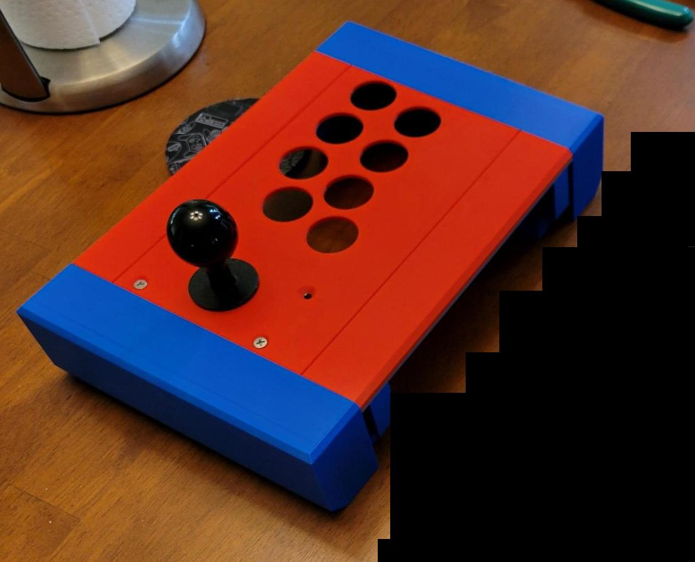

# OpenFightStick
Open Source Modular 3D Printed Fight Stick (designed in Fusion 360)

Designed by : Luke Arntson
Designed for : Prusa i3, Ender 3, 220mm size print bed

<h2>Open Fight Stick V1</h2>

This is a place-holder for information about the Open Fight Stick V1

Render in Fusion 360

3D print (will be replaced)