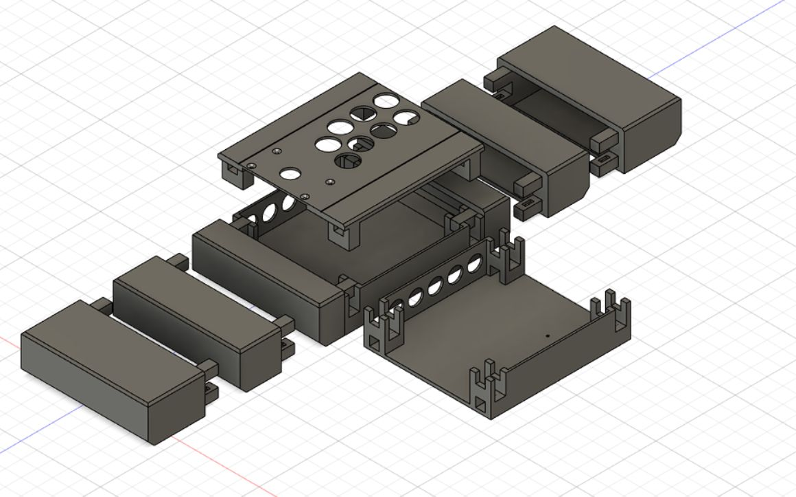

# Open Fight Stick

The Open Fight Stick (OFS3D) is a 3D printable modular arcade stick designed to be customizable and easy to print. The components print perfectly on a Prusa or Ender 3 with a 220mm build plate or greater, and fit together using an origami style construction.

## Features

* Choose your own button layout for the top panel
* Slide-in connections for easy assembly
* Solid and Brooks-spaced board holes on bottom panel
* Easy to modify Fusion360 models
* Ready to print STL files w/ assembly instructions (*coming soon*)
* Swappable side-panels (250mm, 300mm, 350mm, 400mm)
* Open source! Always free!

## Versions

### V1 - First launch of OFS3D!

* Created in Fusion 360 (Non-Commercial License)
* Easy to print
* 5.5mm rectangular magnets to hold panels in place

### GP2040CE - [Official Stick of GP2040-CE](https://github.com/OpenStickFoundation/GP2040-CE)

* *Coming soon!*

## Acknowledgements

* [Luke Arntson](https://github.com/arntsonl/OpenFightStick) creator of the OFS3D
* The [OpenStick GP2040-CE Discord channel](https://discord.gg/KyQCHcjwJ2) for inspiration and feedback