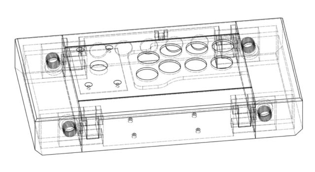

# Open Fight Stick 3D

* [Assembly Instructions](building.md)
* [Downloads](downloads.md)

The Open Fight Stick 3D (OFS3D) is a 3D printable modular arcade stick designed to be customizable and easy to print. The 3D models print build plate with a build plate of at least 240mm x 200mm. Each component of the OFS3D fits together using a similar concept to a tower joint and do not require traditional metal screws or fasteners. Magnets and concrete can be additionally added to the build to add strength to the joints and weight to the overall design.

## Features

* Make your own button layout for the top panel (Vewlix, Noir, Stickless, DIY!)
* Slide-in connections for easy assembly
* Tower joints for added strength and frame rigidity
* Brook board holes on bottom panel for PCB mounting
* Easy to modify Fusion360 models (non-commercial license)
* Ready to print STL files w/ assembly instructions
* Swappable side-panels (Small, Standard, Extra Large)
* Open Source and Free!

## Credits

* [Luke Arntson](https://github.com/arntsonl/OpenFightStick) creator of the OFS3D
* [OpenStickCommunity Discord](https://discord.gg/k2pxhke7q8) for inspiration and feedback
* [GP2040-CE](https://github.com/OpenStickCommunity/GP2040-CE) for endless hours of development fun
* [Level One Bar + Arcade](http://www.level1bar.com/) for all the support and good games